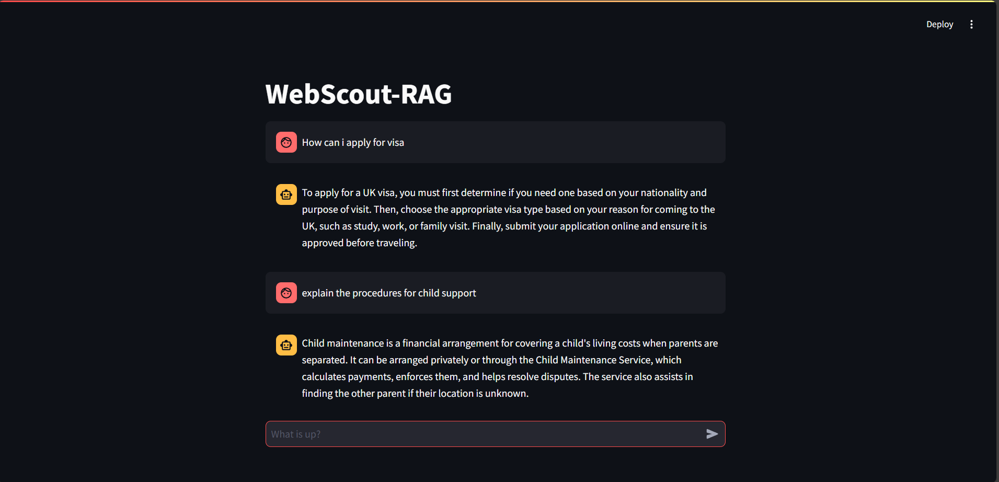

# UK Government Data Scraper Chatbot

A chatbot that scrapes data from the official UK government site in real-time based on user queries. This tool leverages **Retrieval-Augmented Generation (RAG)**, a method that retrieves relevant information from external sources (UK government websites) and uses it to generate responses with enhanced accuracy and context.

## Table of Contents
- [Project Overview](#project-overview)
- [Features](#features)
- [Technologies Used](#technologies-used)
- [Usage](#usage)
- [Contributing](#contributing)
- [License](#license)

## Project Overview

This project provides an interactive chatbot that scrapes data from official UK government websites in real-time. The chatbot uses **Retrieval-Augmented Generation (RAG)**, which combines document retrieval and generation. The chatbot retrieves relevant documents from government sources based on user queries, and generates coherent, contextually enhanced responses using the retrieved data.

The RAG system ensures high-quality responses by:
- **Retrieving** relevant data from external sources (UK government websites).
- **Augmenting** the query with retrieved information to provide accurate and context-rich answers.
- **Generating** a final response by synthesizing the retrieved information.

## Features

- **Real-Time Scraping**: Processes user queries in real-time and retrieves data from official UK government websites.
- **Retrieval-Augmented Generation (RAG)**: Enhances the chatbot’s ability to answer complex queries by combining document retrieval with response generation.
- **Streamlit UI**: User-friendly interface built with Streamlit for easy interaction.
- **Accurate Responses**: Uses real-time data scraping and generation techniques to provide accurate and up-to-date information.

## Technologies Used

- **Python**: The core programming language for building the chatbot.
- **Streamlit**: For creating the web interface for the chatbot.
- **BeautifulSoup**: For scraping and parsing HTML data from UK government websites.
- **Requests**: For making HTTP requests and fetching the data.
- **Retrieval-Augmented Generation (RAG)**: Combines document retrieval with natural language generation to provide enhanced responses.

## Usage

To interact with the chatbot, open the Streamlit app and ask your question. The chatbot will scrape data from the UK government website, process it using the RAG system, and generate an accurate response.

Example usage:

## Contributing

Contributions are welcome! If you want to contribute to this project, feel free to create a pull request or report issues.

1. Fork the repository.
2. Create a new branch for your feature or bugfix.
3. Submit a pull request once you're done.
